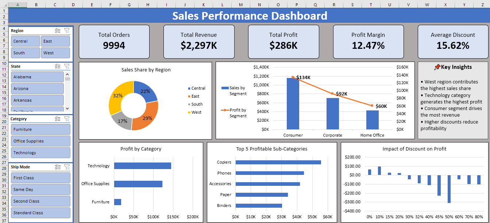

📊 Superstore Sales Dashboard (Excel Project)

🔹 Project Overview: 
This project presents an interactive Excel dashboard built using the popular Superstore dataset.  
The dashboard helps analyze sales performance, profit trends, and regional insights.

🔹 Key Features
- Interactive Pivot Tables
- Dynamic Pivot Charts
- Region, State, Category, Ship Mode Slicers
- KPI Cards for Total Orders, Total Revenue, Total Profit, Profit Margin and Average Discount
- Clean and professional dashboard layout

🔹 Files in This Repository
- 📁 Excel Dashboard Workbook
- 🗂️ Raw Dataset
- 📷 Dashboard Preview Image

🔹 Tools Used
- Microsoft Excel
- Pivot Tables & Charts
- Data Cleaning
- Dashboard Design

📷 Dashboard Preview

🔹 Insights Generated
- West region contributes the highest sales share  
- Technology category generates the highest profit  
- Consumer segment drives the most revenue  
- Higher discounts reduce profitability

-----------------------------------------------------
⭐ Created as part of my Data Analytics Portfolio
